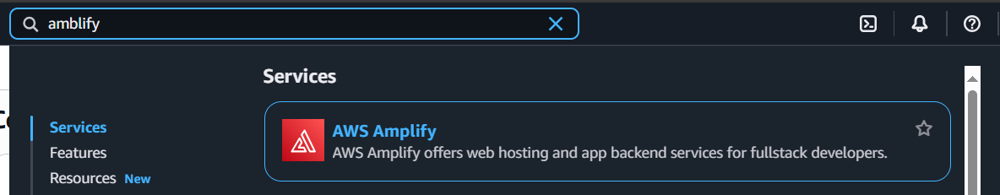

## Host Web App with AWS

### Using Services
- AWS Amplify: used to build and host websites
- AWS Lambda
- AWS API Gateway
- AWS DynamoDB
- AWS IAM

### Architecture

### Setup
#### Option 1: Using AWS console
1. Create a new AWS Amplify project

#### Option 2: Using terraform
1. Install terraform